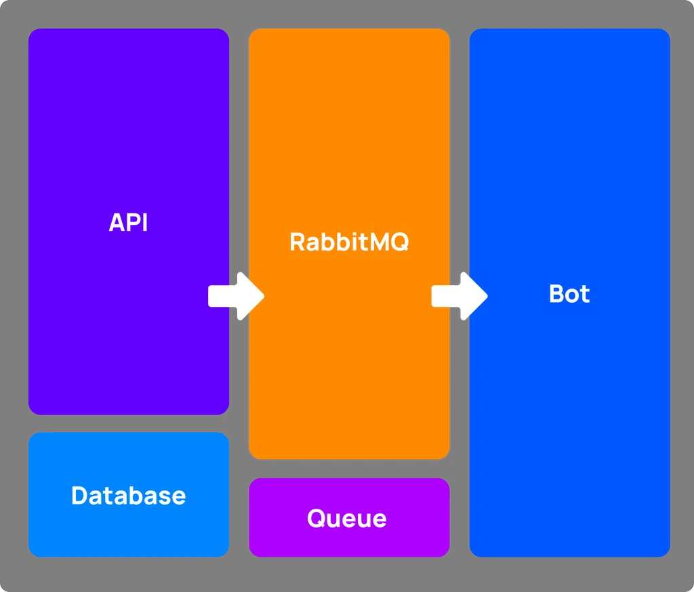
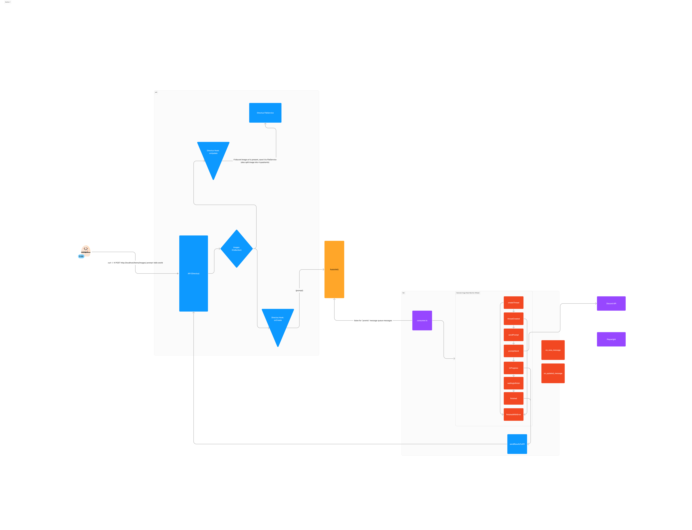

### ImagineAPI.dev — Midjourney API 👋

To get started with self-hosted version, [go here](https://docs.imagineapi.dev/self-host-install/requirements).

To get us to setup for you and handle the hard work, [try a Cloud Plan](https://www.imagineapi.dev/pricing)

## Contributing

1. Follow [these steps to setup a Discord bot with Midjourney](https://docs.imagineapi.dev/self-host-install/discord-bot)
1. Create a `.shared.env` file using [these instructions](https://docs.imagineapi.dev/self-host-install/ImagineAPI#update-sharedenv).
1. Run `docker compose -f docker-compose.dev.yml build` to build the contianers from source.
1. Start the containers using `docker compose -f docker-compose.dev.yml up -d`

If you run into issues, [log them here](https://github.com/imagineapi/imagineapi/issues).

### Troubleshooting

If you encounter issues, you can run `docker compose -f docker-compose.dev.yml logs api` or `docker compose -f docker-compose.dev.yml logs bot` to see logs for the `api` or `bot` services respectively.

### Architecture

There are 3 services at work: API, RabbitMQ, Bot as follows:

In more detail, this is roughly how things work:

## License

ImagineAPI is licensed under the [Elastic License 2.0 (ELv2)](https://github.com/imagineapi/imagineapi/blob/main/LICENSE.md) license because it provides the best balance between freedom and protection. The ELv2 license is a permissive license that allows you to use, modify, and distribute ImagineAPI as long as you follow a few simple rules:

1. **You may not provide ImagineAPI's API to others as a managed service.** For example, you _cannot_ host ImagineAPI yourself and sell it as a cloud-based licensing service, competing with ImagineAPI Cloud. However, you _can_ sell a product that directly exposes and utilizes ImagineAPI's API, as long as ImagineAPI cannot be used outside of your product for other purposes (such as your customer using an embedded ImagineAPI instance to license _their_ product in addition to _your_ product).

1. You may not alter, remove, or obscure any licensing, copyright, or other notices.

Anything else is fair game. There's no clause that requires you to open source modifications made to ImagineAPI or other derivative works.

You can embed ImagineAPI in your on-premise application.

You can run ImagineAPI on a private network.

You can fork ImagineAPI into a private repo.

If the ELv2 license doesn't work for your company, please [reach out](mailto:team@imagineapi.dev).

The license is available [here](https://github.com/imagineapi/imagineapi/blob/main/LICENSE.md).